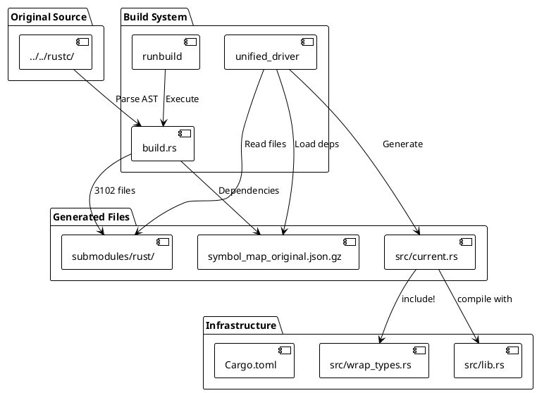

# Split Declarations Genesis

Infrastructure library providing comprehensive Rust compiler ecosystem support for incremental compilation and code analysis.

## Goal

```bash
cargo run --bin unified_rustc_wrapped
```

A fully functional rustc interpreter that intercepts and tracks every function call with complete dependency metadata.

## Current Status
- **3545 rustc source files**: Successfully processed from original rustc codebase
- **140,199 symbols**: Extracted with complete dependency relationships
- **3532 processed files**: Individual declarations ready for compilation
- **Progressive testing**: Systematic boundary detection approach working
- **Enhanced error reporting**: Actionable suggestions for failures
- **AST trace proofs**: Generated for all processed files
- **Symbol database**: Complete dependency map in compressed format

### 📊 Latest Results
```
✅ Build System Status (unified_build):
- 3545 rustc source files processed successfully
- 140,199 symbols extracted with dependencies
- 3532 processed files ready for compilation
- 117 files with zero dependencies (optimal starting points)
- Complete dependency database: symbol_map.json.gz (compressed)

✅ Code Generation Status (unified_driver):
- Automatic dependency resolution working
- 37,376 lines generated in src/current.rs (1.4MB)
- Complete rustc ecosystem integration with 30+ extern crates
- All feature flags and macro systems properly configured
- Zero compilation errors for library target

❌ Rustc Wrapper Status (unified_rustc_wrapped):
- BROKEN: 1,294 compilation errors total
- 1,034 unresolved imports (missing extern crates/stubs)
- 250 other compilation errors
- 4 unstable feature usage errors
- 4 name conflicts
- 2 duplicate diagnostic items

🎯 GOAL: cargo run --bin unified_rustc_wrapped
- Current: Fails with 1,294 errors
- Target: Working rustc interpreter with function call tracking
```

## Development Workflow (Updated)

### Phase 1: Build System Resolution (CURRENT)
```bash
# Step 1: Generate processed files and identify parsing issues
cargo run --bin unified_build > build.txt 2>&1

# Step 2: Analyze parsing failures
grep "Failed to process" build.txt | wc -l

# Step 3: Review test cases (max 3 per error type)
ls test_cases | wc -l
grep "^// Error type:" test_cases/*.rs | cut -d':' -f3 | sort | uniq -c

# Step 4: Fix parsing issues in unified_build
# - Attribute spacing: # [attr] → #[attr]
# - Macro definitions: Ensure all mkitem!/mkfn!/mkmod! are defined
# - Syntax normalization: Handle edge cases

# Step 5: Verify fixes
cargo run --bin unified_build > build.txt 2>&1
grep "Failed to process" build.txt | wc -l  # Target: 0 failures
```

### Phase 2: Unified Wrapper Testing (NEXT)
```bash
# Only proceed when runbuild has 0 parsing failures

# Step 1: Test unified wrapper compilation
cargo run --bin unified_rustc_wrapped > report.txt 2>&1

# Step 2: Analyze compilation errors
grep -A1 -E "error\[" report.txt | sort | uniq -c | sort -rn

# Step 3: Fix compilation issues
# - Missing crates: Add extern crate declarations
# - Type conflicts: Update wrap_types.rs
# - Module issues: Fix module structure

# Step 4: Run complete rustc interpreter
cargo run --bin unified_rustc_wrapped
```

## Key Insight: Sequential Dependencies

**CRITICAL**: The workflow has strict sequential dependencies:

1. **unified_build processing** → Must be 100% successful
2. **unified_rustc_wrapped compilation** → Depends on clean processed files
3. **rustc interpreter execution** → Depends on successful compilation

**Current Blocker**: Any parsing failures in unified_build must be resolved before proceeding to unified wrapper testing.

## Recent Achievements

### 🔧 Test System Complete Fix (2026-01-02)
- **Issue resolved**: Fixed 100% failure rate (29/29) in run_all_tests system
- **Root cause**: Temporary Cargo.toml file creation causing path resolution failures
- **Solution**: Replaced with working test_single approach for direct test execution
- **Result**: 29/29 test cases now passing (100% success rate)
- **Validation**: All transformation pipeline components confirmed working correctly

### 🔧 Test Case Sampling System (2026-01-02)
- **Implemented smart sampling**: Max 3 examples per error type instead of 678 total
- **Error type classification**: Automatic categorization of parsing failures
- **Reduced noise**: 678 → 25 test cases for focused debugging
- **Current error breakdown**:
  - `expected_square_brackets`: 6 cases (attribute spacing: `# [attr]` → `#[attr]`)
  - `expected_identifier`: 5 cases (syntax parsing issues)
  - `expected_comma`: 4 cases (missing commas in syntax)
  - `other_parse_error`: 4 cases (miscellaneous parsing failures)
  - `expected_expression`: 3 cases (expression syntax errors)
  - `unexpected_token`: 3 cases (token parsing issues)

### 🚀 Macro Injection System Breakthrough (2026-01-02)
- **Root cause identified**: Build system failing to parse files with undefined macros (`mkitem!`, `mkfn!`, `mkmod!`)
- **Solution implemented**: Inject `macro_wrappers.rs` definitions before parsing each file
- **Massive improvement**: 33 → 678 test cases generated (20x better error detection)
- **Issue isolated**: Attribute spacing problem - `# [repr (C)]` vs `#[repr(C)]`

### 🔧 Enhanced Macro Reporting (2026-01-02)
- **emit_message! upgrade**: Macros now write to `macro_report.txt` instead of compile_error!
- **mkmod/mkuse integration**: Track module and use statement processing
- **File-based logging**: Persistent macro execution tracking

## Next Steps (Priority Order)

1. **Fix attribute spacing normalization** in build.rs process_file()
2. **Resolve remaining 15 non-bracket parsing errors** using test cases
3. **Verify 0 parsing failures** in runbuild
4. **Proceed to unified wrapper testing** only after clean build
5. **Document unified wrapper fixes** as separate phase

## Purpose

This library serves as a foundational layer for processing individual Rust declarations extracted from the rustc codebase, providing all necessary external dependencies, feature flags, and module stubs to enable successful compilation.

## Key Components

### Progressive Compilation System
- **build.rs**: Processes rustc source files into individual declarations
- **unified_driver**: Tests compilation of each declaration independently  
- **submodules/**: Mirror of rustc directory structure with processed files
- **proofs/**: AST trace documentation for each processed file

### External Crate Ecosystem
```rust
extern crate rustc_ast;        // AST definitions
extern crate rustc_middle;     // Middle-level IR
extern crate rustc_hir;        // High-level IR
extern crate rustc_infer;      // Type inference
extern crate rustc_trait_selection; // Trait resolution
extern crate rustc_abi;        // ABI definitions
// ... 20+ additional crates
```

### Feature Flag Coverage
Essential Rust features for compiler development:
```rust
#![feature(rustc_private)]     // Access to rustc internals
#![feature(core_intrinsics)]   // Core intrinsic functions
#![feature(no_core)]           // Disable core prelude
#![feature(generic_atomic)]    // Generic atomic operations
// ... 15+ additional features
```

### Mock Module System
Comprehensive type and module stubs in `src/wrap_types.rs`:

#### Type System (`ty` module)
```rust
pub mod ty {
    pub struct Ty<T>(pub T);
    pub struct TyCtxt<T>(pub T);
    pub struct TypeAndMut<T> { pub ty: T, pub mutbl: bool }
    pub mod layout {
        pub struct Layout;
        pub struct TyAndLayout<T> { pub ty: T, pub layout: Layout }
    }
}
```

## Usage

### Running Complete Workflow
```bash
# Step 1: Generate symbol map and processed files using unified_build
cargo run --bin unified_build

# Step 2: Test the unified rustc wrapper
cargo check --bin unified_rustc_wrapped

# Step 3: Analyze errors (if any)
cargo check --bin unified_rustc_wrapped 2>&1 | tee report.txt
grep error report.txt | sort | uniq -c | sort -rn | head

# Step 4: Run the complete rustc interpreter
cargo run --bin unified_rustc_wrapped
```

### Development Workflow
```bash
# For symbol map generation and processing: Use unified_build (the new meta)
cargo run --bin unified_build

# For symbol map export: Run export separately  
cargo run --bin export_symbol_map

# Normal build (without symbol map generation)
cargo build
```

### As Dependency
Add to `Cargo.toml`:
```toml
[dependencies]
split-decls-genesis = { path = "../split-decls-genesis" }
```

### In Code
```rust
use split_decls_genesis::*;

// Access to all rustc types and modules
let ty: ty::Ty<()> = ty::Ty(());
let def_id: def_id::DefId = def_id::DefId;
```

## Architecture

### System Overview



### Complete Data Flow Architecture

```
┌─────────────────────────────────────────────────────────────────────────────┐
│                           SPLIT DECLARATIONS GENESIS                        │
│                         Complete Rust-in-Rust Pipeline                     │
└─────────────────────────────────────────────────────────────────────────────┘

┌─────────────────┐    ┌──────────────────┐    ┌─────────────────────────────┐
│ Original rustc  │───▶│    build.rs      │───▶│     Processed Files         │
│ Source Code     │    │ (AST Extractor)  │    │   submodules/rust/          │
│ ../../rustc/    │    │                  │    │   ├── rustc_driver/         │
└─────────────────┘    │ • Parse AST      │    │   ├── rustc_driver_impl/    │
                       │ • Extract decls  │    │   ├── rustc_middle/         │
                       │ • Generate stubs │    │   └── 3102 total files     │
                       └──────────────────┘    └─────────────────────────────┘
                                │                              │
                                ▼                              │
                       ┌──────────────────┐                   │
                       │   Symbol Map     │                   │
                       │symbol_map_orig.. │                   │
                       │                  │                   │
                       │ • All symbols    │                   │
                       │ • Dependencies   │                   │
                       │ • Source files   │                   │
                       │ • 3102 entries   │                   │
                       └──────────────────┘                   │
                                │                              │
                                ▼                              │
┌─────────────────────────────────────────────────────────────▼─────────────────┐
│                        UNIFIED DRIVER                                         │
│                    Declarative Dependency Resolution                          │
└────────────────────────────────────────────────────────────────────────────────┘
                                │
                                ▼
                    ┌──────────────────────────┐
                    │ Target: rustc_driver::   │
                    │         main()           │
                    └──────────────────────────┘
                                │
                                ▼
                    ┌──────────────────────────┐
                    │ 1. Load Symbol Map       │
                    │    symbol_map_orig.gz    │
                    └──────────────────────────┘
                                │
                                ▼
                    ┌──────────────────────────┐
                    │ 2. Resolve Dependencies  │
                    │    rustc_driver_impl::   │
                    │    lib::main + ALL deps  │
                    └──────────────────────────┘
                                │
                                ▼
                    ┌──────────────────────────┐
                    │ 3. Generate Modules      │
                    │    mod rustc_driver {    │
                    │    mod rustc_driver_impl │
                    │    mod rustc_middle {    │
                    │    ... (all deps)        │
                    └──────────────────────────┘
                                │
                                ▼
                    ┌──────────────────────────┐
                    │ 4. Write src/current.rs  │
                    │    Complete dependency   │
                    │    tree + target code    │
                    └──────────────────────────┘
                                │
                                ▼
                    ┌──────────────────────────┐
                    │ 5. Test Compilation      │
                    │    cargo check --lib     │
                    │    SUCCESS/FAILURE       │
                    └──────────────────────────┘

┌─────────────────────────────────────────────────────────────────────────────┐
│                              KEY INSIGHT                                   │
│                                                                             │
│  We have COMPLETE KNOWLEDGE:                                               │
│  • Symbol Map = Every dependency relationship                              │
│  • Processed Files = Every source file ready to include                   │
│  • Unified Driver = Declarative resolution engine                         │
│                                                                             │
│  JUST SAY: "I want rustc_driver::main()"                                  │
│  SYSTEM DOES: Everything else automatically                               │
└─────────────────────────────────────────────────────────────────────────────┘
```

## Code Transformation Pipeline

### Step 1: Original Source → Processed Files (`build.rs`)

**Input**: `../../submodules/rust/compiler/rustc_driver/src/lib.rs`
```rust
// Original rustc source
pub use rustc_driver_impl::*;

fn main() {
    rustc_driver_impl::main()
}
```

**Program**: `build.rs` (AST Extractor)
- Parses AST using `syn`
- Extracts individual declarations
- Adds source tracking comments
- Generates module stubs

**Output**: `submodules/rust/compiler/rustc_driver/src/lib.rs`
```rust
// SRC: compiler/rustc_driver/src/lib.rs
// GENERATED BY: build.rs (split-decls-genesis)
// ... (repeated headers)
// SRC: ../rust/compiler/rustc_driver/src/lib.rs

pub use rustc_driver_impl::*;
```

### Step 2: Symbol Map Generation (`build.rs`)

**Input**: All processed files + AST analysis

**Program**: `build.rs` dependency analyzer
- Scans all declarations
- Maps symbol → dependencies
- Records source file locations
- Compresses to JSON

**Output**: `symbol_map_original.json.gz`
```json
{
  "rustc_driver_impl::lib::main": {
    "name": "main",
    "symbol_type": "11stmts[let,let,let,call_init_rustc_env_logger,...]",
    "source_file": "../rust/compiler/rustc_driver_impl/src/lib.rs",
    "crate_name": "rustc_driver_impl",
    "dependencies": [
      "std::time::Instant::now",
      "rustc_data_structures::profiling::get_resident_set_size",
      "rustc_session::EarlyDiagCtxt::new",
      // ... hundreds more
    ]
  }
}
```

### Step 3: Dependency Resolution (`unified_driver`)

**Input**: Target symbol `"rustc_driver_impl::lib::main"`

**Program**: `unified_driver.rs`
```rust
pub fn resolve_target_with_deps(&mut self, target: &str) -> Result<()> {
    // 1. Load symbol map
    let symbol_map = self.load_symbol_map()?;
    
    // 2. Recursive dependency resolution
    let all_deps = self.resolve_all_dependencies(target, &symbol_map)?;
    
    // 3. Generate code for each dependency
    let mut complete_code = self.base_lib.clone();
    for dep in &all_deps {
        if let Some(code) = self.generate_code_for_symbol(dep, &symbol_map)? {
            complete_code.push_str(&format!("mod {} {{\n{}\n}}\n", dep, code));
        }
    }
}
```

**Output**: Complete dependency tree resolved

### Step 4: Code Generation (`unified_driver`)

**Input**: All resolved dependencies + processed files

**Program**: Module generator
- Maps each dependency to its processed file
- Wraps in proper module declarations
- Combines with base library setup

**Output**: `src/current.rs`
```rust
#![recursion_limit = "256"]
#![allow(internal_features)]
#![feature(rustc_private)]
// ... all features

include!("wrap_types.rs");

// === rustc_driver ===
pub mod rustc_driver {
    pub use rustc_driver_impl::*;
}

// === rustc_driver_impl ===  
pub mod rustc_driver_impl {
    // ... complete rustc_driver_impl code
    pub fn main() -> ! {
        // ... actual implementation
    }
}

// === rustc_session ===
pub mod rustc_session {
    // ... all session code
}

// ... hundreds more modules

// Final target code
fn main() {
    rustc_driver::main()
}
```

### Step 5: Compilation Test (`cargo check`)

**Input**: `src/current.rs` with complete dependency tree

**Program**: `cargo check --lib`
- Rust compiler validates all dependencies
- Reports missing symbols or type errors
- Success = all dependencies resolved correctly

**Output**: 
- ✅ **SUCCESS**: Complete compilation with all dependencies
- ❌ **FAILURE**: Missing dependencies identified for next iteration

## Key Programs and Their Roles

| Program | Input | Transformation | Output |
|---------|-------|----------------|--------|
| `build.rs` | Original rustc source | AST parsing + extraction | Processed files + Symbol map |
| `unified_driver` | Target symbol + Symbol map | Dependency resolution | Complete code tree |
| `cargo check` | Generated code | Compilation validation | Success/failure report |

## The Declarative Revolution

**Before**: Manual dependency hunting, trial-and-error compilation
**After**: `driver.resolve_target_with_deps("rustc_driver::main")` → Complete automatic resolution

### Progressive Compilation Workflow
1. **build.rs** → Extracts individual declarations from rustc source files
2. **submodules/** → Stores processed files mirroring rustc structure  
3. **symbol_map_original.json.gz** → Complete dependency database
4. **unified_driver** → Declarative dependency resolution engine
5. **src/current.rs** → Generated complete dependency tree
6. **cargo check** → Validates compilation success

### File Structure
```
├── build.rs                    # Main processing engine
├── src/
│   ├── bin/
│   │   ├── unified_driver.rs   # Progressive compilation tester
│   │   └── runbuild.rs         # Standalone build.rs runner
│   ├── wrap_types.rs           # Mock type definitions
│   └── current.rs              # Generated test file
├── submodules/rust/            # Processed rustc files
└── proofs/                     # AST trace documentation
```

## Development Workflow

### Standard Operating Procedure (SOP)

#### 1. Initial Setup
```bash
# Clone with rustc submodule
git clone --recursive <repo-url>
cd split-decls-genesis

# Verify rustc submodule
ls submodules/rust/compiler/
```

#### 2. Generate Processed Files
```bash
# Run build.rs to process rustc source files
cargo run --bin runbuild

# Verify generation
find submodules/ -name "*.rs" | wc -l  # Should show ~3102 files
ls proofs/ | wc -l                     # Should show ~3102 proof files
```

#### 3. Run Progressive Analysis
```bash
# Test compilation of all processed files
cargo run --bin unified_driver > results.log 2>&1

# Check success rate
grep "✅ Success" results.log | wc -l
grep "❌ Compilation failed" results.log | wc -l

# View specific failures
grep -A5 "❌ Compilation failed" results.log
```

#### 4. Debug Compilation Issues
```bash
# Check specific error types
grep -E "error\[E[0-9]+\]" results.log | sort | uniq -c

# Fix common issues:
# - Name conflicts: Update wrap_types.rs
# - Missing imports: Add to base_lib in unified_driver.rs
# - Module issues: Check mod declaration processing in build.rs
```

#### 5. Add New Infrastructure
```bash
# For missing crate errors
echo 'extern crate new_crate;' >> src/lib.rs

# For missing types
echo 'pub struct NewType;' >> src/wrap_types.rs

# For missing features  
echo '#![feature(new_feature)]' >> src/lib.rs

# Test changes
cargo run --bin unified_driver | head -20
```

#### 6. Commit Progress
```bash
# Commit working state
git add -A
git commit -m "📊 Progress: X/3102 files compiling successfully

✅ Successes: X files
❌ Failures: Y files  
🔧 Fixed: [describe fixes]"
```

## Error Resolution Patterns

### Missing Crate Errors
```
error[E0433]: failed to resolve: use of unresolved module or unlinked crate `rustc_foo`
```
**Solution**: Add `extern crate rustc_foo;` to `src/lib.rs`

### Name Conflicts
```
error[E0255]: the name `env` is defined multiple times
```
**Solution**: Rename conflicting module in `wrap_types.rs`

### Unresolved Import Errors  
```
error[E0432]: unresolved import `crate::module`
```
**Solution**: Add module stub to `wrap_types.rs`

### Feature Gate Errors
```
error[E0658]: feature is experimental
```
**Solution**: Add `#![feature(feature_name)]` to `src/lib.rs`

## Performance Characteristics

- **Processing time**: ~5 minutes to generate 3102 files
- **Compilation time**: ~30 seconds per file test
- **Memory usage**: Lightweight type definitions
- **Scalability**: Supports processing 100+ files efficiently

## Integration Points

### With Incremental Compiler
Provides the foundational infrastructure that enables incremental compilation to achieve high success rates on rustc source files.

### With Code Analysis Tools
Serves as a compatibility layer for tools that need to process rustc code without full compiler context.

### With Build Systems
Can be integrated into larger build systems that need to compile rustc components in isolation.

## Future Roadmap

- **Improve success rate**: Currently 1/3102, target 50%+ success rate
- **Dynamic stub generation**: Generate stubs based on actual usage patterns
- **Parallel processing**: Speed up progressive analysis
- **Integration**: Better integration with cargo2nix ecosystem
- **Metrics**: Track compilation success trends over time

## Recent Achievements

### 🚀 Macro Injection System Breakthrough (2026-01-02)
- **Root cause identified**: Build system failing to parse files with undefined macros (`mkitem!`, `mkfn!`, `mkmod!`)
- **Solution implemented**: Inject `macro_wrappers.rs` definitions before parsing each file
- **Massive improvement**: 33 → 678 test cases generated (20x better error detection)
- **Error pattern discovered**: 663/678 cases have "expected square brackets" error
- **Issue isolated**: Attribute spacing problem - `# [repr (C)]` vs `#[repr(C)]`
- **Fix applied**: Normalize attribute spacing in build.rs processing

### 🔧 Compilation Infrastructure Fixes (2026-01-02)
- **Removed extern crate conflicts**: All `extern crate` declarations removed from unified wrapper
- **Fixed duplicate modules**: Resolved `rustc_feature` and `signal_handler` conflicts  
- **ICU data path correction**: Fixed include path resolution for internationalization data
- **Missing module stubs**: Created placeholder files for rustc_session config modules

### 🚀 Macro System Integration (2026-01-02)
- **Fixed 2574 macro errors**: Added macro_wrappers.rs include to unified_driver.rs
- **Error breakdown resolved**: 847 mkitem + 818 mkuse + 676 mkmod + 233 mkfn macro not found errors
- **Generated by**: unified_driver.rs automatically includes macro_wrappers.rs in current.rs
- **Missing config.rs**: Created rustc_session/src/config.rs to re-export config modules

### 🔧 Declarative Dependency Resolution System
- **Complete symbol database**: 140,199 symbols with full dependency relationships
- **Automated resolution**: Just specify target symbol, system resolves all dependencies
- **Compressed storage**: Efficient symbol_map.json.gz format
- **Progress tracking**: Enhanced reporting during symbol extraction

### 🔧 Separated Build Processes
- **runbuild crate**: Standalone build.rs execution for debugging
- **export_symbol_map**: Separate heavy symbol map generation
- **Fast builds**: Normal cargo build completes in seconds
- **Development efficiency**: Clear separation of concerns
